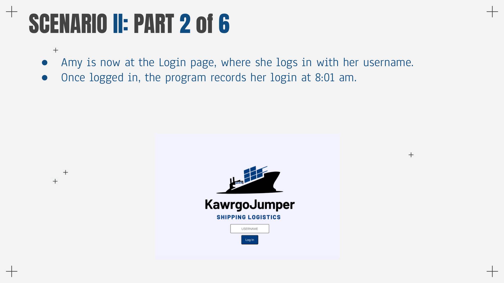
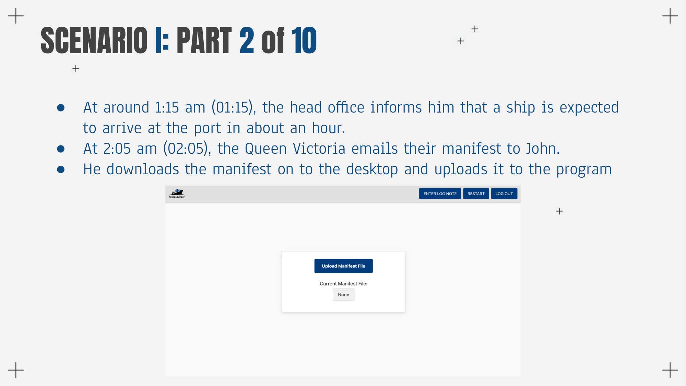
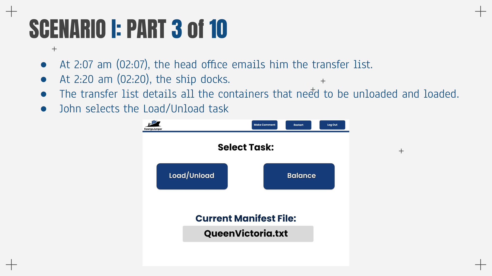
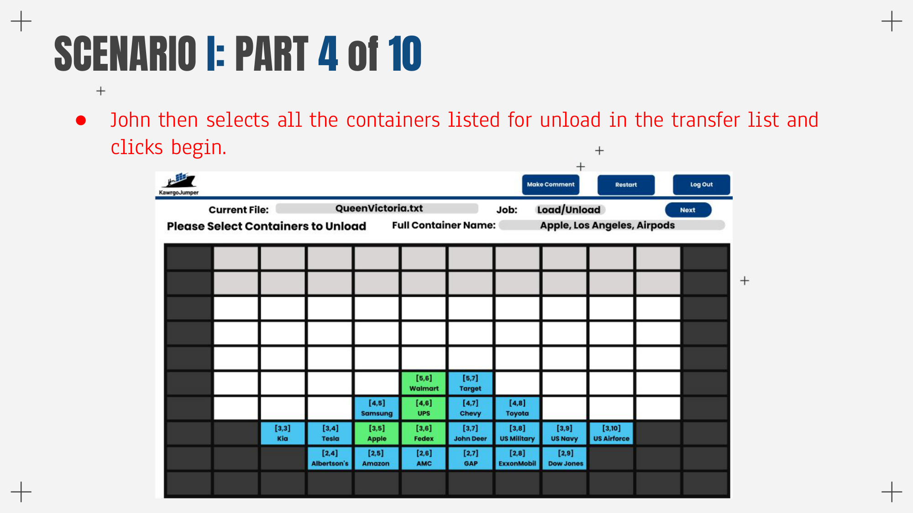
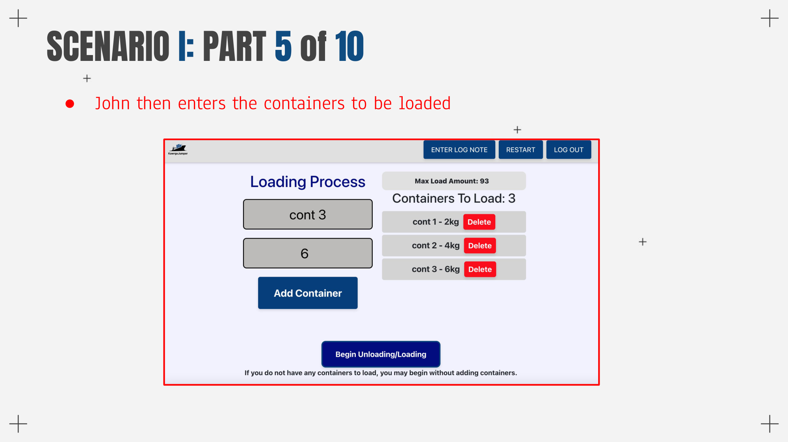
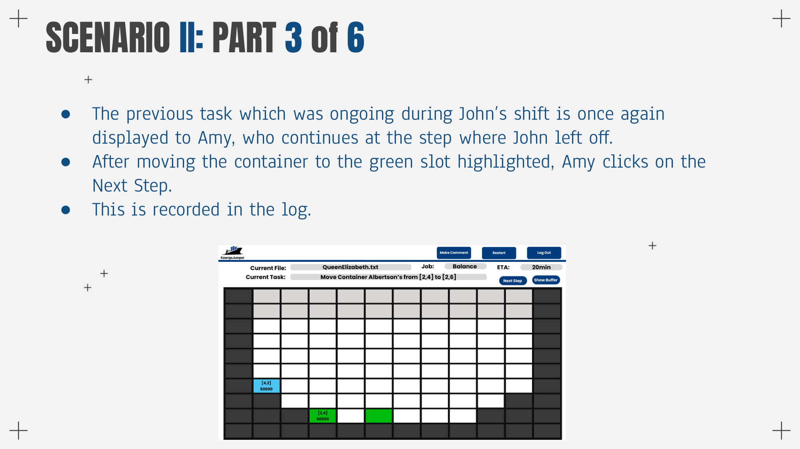
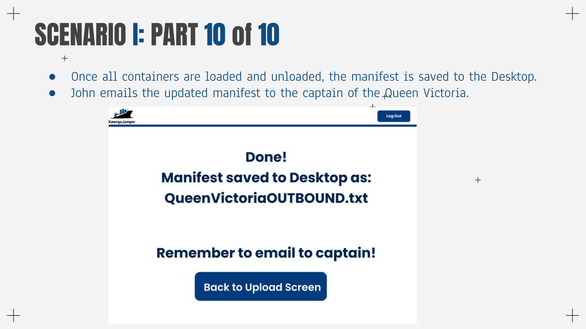

## KawrgoJumper  
Senior AI / ML Capstone Project — Port Logistics Optimization

KawrgoJumper is an AI/ML senior capstone project that explores how algorithmic planning and optimization can support real-world port logistics operations. The system assists operators by generating structured, step-by-step workflows for container loading, unloading, and ship balancing under realistic operational constraints.

This repository contains the **frontend application**, which visualizes logistics workflows and presents algorithm-informed decisions in a clear, human-readable format.

---

## Screenshots

### Login & Manifest Upload

### Task Selection

### Load / Unload Workflow

### Balancing Operation

### Completion & Output

---

## Project Context

Modern port operations must balance efficiency, safety, and legal constraints while handling large volumes of cargo under time pressure. Manual planning is error-prone and difficult to scale.

KawrgoJumper was developed as a **senior AI/ML capstone** to explore how algorithmic decision-making
